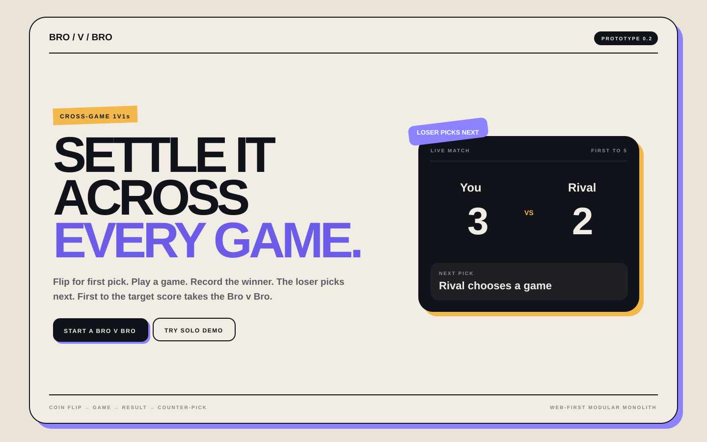
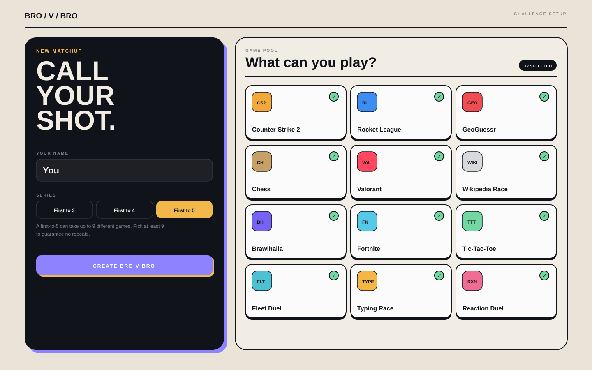
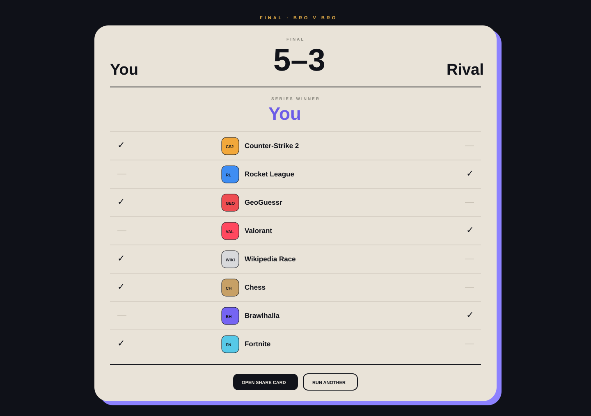

# Bro v Bro

Cross-game 1v1s without the Notepad.

**Core rule:** flip for first pick → play a game → report/confirm the winner → **loser picks next** → repeat until someone reaches the target score.

> Status: architecture + multiplayer prototype. The friend-vs-friend loop is implemented with a local SQLite persistence adapter so two browser sessions can create/join/play the same match during development.

## Product direction

The MVP intentionally does **not** try to understand every game's rules, automatically verify results, or calculate a universal gaming MMR. The product owns the *gauntlet*, not the third-party games.

- creator sends a challenge link
- both players establish a game pool
- server persists one coin flip for first pick
- current selector chooses or uses Random
- either player reports a winner
- the opponent confirms or disputes
- confirmed loser becomes the next selector
- final screen shows exactly who won each game
- completed matches can render a shareable SVG result card

## Screenshots

### Landing page



### Create a challenge



### Final comparison / victory card



The current design uses game abbreviations as artwork placeholders. Canonical provider artwork/logos are a later catalog concern so the match state does not depend on Steam/Epic/etc.

## Current implementation

### Domain

- pure TypeScript gauntlet state machine
- no provider/framework/database dependencies in the domain
- first-pick coin flip
- manual and random selection
- no-repeat default
- submit → opponent confirm/dispute result flow
- loser-picks-next transition
- immutable game-by-game result ledger
- optimistic version number

### Application

- command envelope with `expectedVersion` and `idempotencyKey`
- idempotent retries are checked before stale-version rejection
- server-generated randomness for coin flip/random selection
- repository contract around the authoritative session

### Local multiplayer prototype

- create challenge
- secret host token + invite token
- invitee joins with a display name
- both players resolve to the same authoritative session
- polling keeps two browser tabs/windows synchronized
- local SQLite persistence survives refresh/reconnect and dev-server route calls
- server-side participant authorization for session reads/commands

### Sharing

- side-by-side NFL/broadcast-inspired victory screen
- private SVG share-card route generated from the authoritative result ledger
- same projection is designed to feed a future Discord message / Open Graph card

## Run locally

Requires Node 22+ because the development persistence adapter uses Node's built-in `node:sqlite`.

```bash
npm install
npm run dev
```

Open `http://localhost:3000` and choose **Start a Bro v Bro**.

To test the multiplayer path:

1. Create a challenge in Browser A.
2. Copy the invite URL from the lobby.
3. Open it in Browser B/incognito.
4. Join as the rival.
5. Both browsers enter the match.
6. Flip → select → start → report → confirm → repeat.

Run the dependency-free domain/application tests:

```bash
npm run test:domain
```

## Architecture

The current shape is a **web-first modular monolith**:

```text
Browser A ─┐
           ├── Next.js web/BFF ── application commands ── gauntlet domain
Browser B ─┘                         │                       │
                                     │                       └── pure state machine
                                     ├── challenge/guest access
                                     ├── catalog
                                     └── repository interfaces
                                              │
                                   ┌──────────┴───────────┐
                                   │                      │
                              local SQLite          production Postgres
                              (prototype)            (next persistence slice)

Steam / Discord / future providers sit behind adapters and never mutate match state directly.
```

See:

- [`docs/architecture.md`](docs/architecture.md)
- [`docs/adr/001-modular-monolith.md`](docs/adr/001-modular-monolith.md)
- [`docs/design-language.md`](docs/design-language.md)
- [`docs/phase-2-multiplayer.md`](docs/phase-2-multiplayer.md)
- [`docs/api-shape.md`](docs/api-shape.md)

## Roadmap

- [x] Domain state machine
- [x] Coin flip
- [x] Manual game selection
- [x] Random game selection
- [x] Loser-picks-next transition
- [x] Submit + opponent confirm/dispute
- [x] Game-by-game result ledger
- [x] Two-browser guest invite flow
- [x] Local persistent session adapter
- [x] SVG victory/share card
- [ ] Production PostgreSQL repository
- [ ] Real account/session auth
- [ ] Canonical manual game catalog management
- [ ] Steam OpenID + library import
- [ ] Provider game artwork mapping
- [ ] Public/private share-token model + Open Graph image
- [ ] Discord live match card
- [ ] Discord Activity / Rich Presence experiment
- [ ] Deployment

## Important prototype limitation

`node:sqlite` is being used only as a **development persistence adapter**. It is not the production deployment architecture, especially on ephemeral/serverless filesystems. The domain/application layers do not depend on SQLite, so the production repository can move to PostgreSQL without changing match rules.
